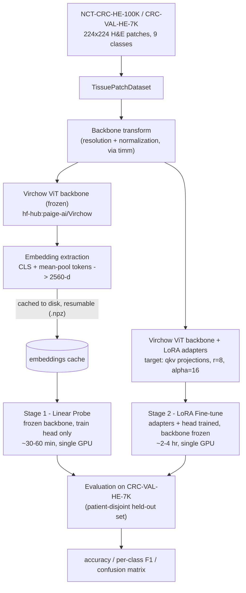
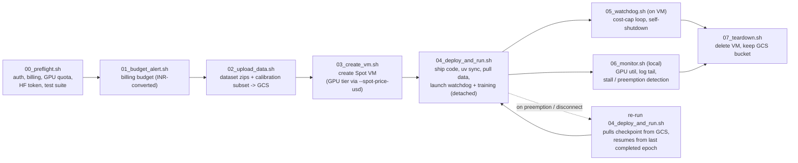

# Tissue Classifier

Fine-tunes **Virchow**, an open pathology vision foundation model, into a 9-class
colorectal histology tissue classifier — trained and evaluated on the
**NCT-CRC-HE-100K / CRC-VAL-HE-7K** benchmark (Kather et al., 2018).


## Overview

Colorectal cancer histology classification on NCT-CRC-HE-100K is a
well-studied, fully-labeled benchmark — the held-out set is already
near-saturated, with published supervised/transfer-learning accuracy in the
94.3–98.3% range. Because the dataset is 100% labeled, self-supervised
pretraining's usual label-efficiency advantage doesn't apply here. The
efficient, evidence-backed path is instead to **fine-tune an existing
pathology foundation model** rather than pretrain one from scratch.

This repo does exactly that, in two stages of increasing cost and strength:

1. **Linear probe** — freeze Virchow, cache its embeddings once, train a
   linear head on top. Cheap baseline (~30–60 min, single GPU).
2. **LoRA fine-tune** — attach low-rank adapters to Virchow's attention
   projections and fine-tune those (base weights stay frozen). Stronger
   result at a fraction of full-fine-tune cost (~2–4 hr, single GPU).

Both stages are evaluated identically on **CRC-VAL-HE-7K**, a *patient-disjoint*
held-out set (different patients than the training set), to avoid data
leakage — and are reported side by side so the incremental value of LoRA
over the frozen probe is explicit.

The full reasoning behind this design — including why an earlier
from-scratch self-supervised (leJEPA) plan was rejected — is written up in
[`docs/superpowers/specs/2026-07-02-lejepa-tissue-classifier-design.md`](docs/superpowers/specs/2026-07-02-lejepa-tissue-classifier-design.md)
and the supporting research brief at
[`outputs/jepa-vs-traditional-cv-ml.md`](outputs/jepa-vs-traditional-cv-ml.md).

## Architecture



Key implementation details:

- **Backbone**: Virchow is loaded via `timm` from the Hugging Face Hub
  (`hf-hub:paige-ai/Virchow`), gated behind HF's access terms despite its
  Apache 2.0 license. Its `forward()` returns unpooled per-token output, so
  `foundation_model.py` wraps it to reproduce Paige's documented usage:
  concatenate the CLS token with the mean of the remaining patch tokens,
  producing a single 2560-d embedding per image. It also requires SwiGLU MLP
  kwargs (`SwiGLUPacked`, `SiLU`) that plain `timm.create_model` doesn't
  supply by default — only applied for this exact model name, never guessed
  for other backbones.
- **Backbone selection is a config value**, not hardcoded — `GigaPath` (also
  Apache 2.0) is a documented alternative behind the same `backbone` key.
- **The linear probe and the LoRA fine-tune use different data paths**: the
  probe reads pre-extracted, cached embeddings (fast, repeatable); LoRA needs
  gradients to flow through the (adapter-augmented) backbone, so it runs on
  raw images each step.

## Getting started

Requires Python 3.10+ and [uv](https://docs.astral.sh/uv/).

```bash
# install dependencies
uv sync

# download a small stratified subset for local pipeline verification
# (the full ~11 GiB dataset is never pulled onto a laptop)
./scripts/download_data.sh --subset 30

# run the local smoke test: real Virchow weights, ~300 images, CPU/MPS
uv run python scripts/run_local_smoke.py configs/local_smoke.yaml

# run the test suite
uv run pytest -q
```

```bash
# full-scale run (cloud GPU): frozen linear probe + LoRA fine-tune on the
# full 100K train / 7K eval set
uv run python scripts/run_cloud_train.py configs/lora_finetune.yaml
```

## Configs

Every run is driven by a YAML config; the same pipeline code runs locally,
in Colab, or on a GCP VM — only the config changes.

| Config | Purpose | Data | Epochs (probe / LoRA) |
|---|---|---|---|
| `configs/local_smoke.yaml` | Pipeline verification on a laptop (CPU/MPS) | ~300-image stratified subset | 5 / 2 |
| `configs/calibration.yaml` | Empirical GPU-tier comparison before committing to a full run | small calibration subset (60/class train, 20/class eval) | 2 / 2 |
| `configs/linear_probe.yaml` | Full-scale frozen linear probe | full 100K / 7K | 20 / — |
| `configs/lora_finetune.yaml` | Full-scale LoRA fine-tune | full 100K / 7K | 20 / 50 |

`device: auto` resolves to `cuda` → `mps` → `cpu`; `precision: auto` prefers
`bf16` on GPUs with compute capability ≥ 8.0, `fp16` otherwise, `fp32` off
CUDA. The resolved device is always logged so an accidental CPU run is
visible.

## Dataset

[NCT-CRC-HE-100K / CRC-VAL-HE-7K](https://zenodo.org/records/1214456)
(Kather, Halama & Marx, 2018) — 100,000 H&E-stained colorectal tissue
patches (224×224px, 0.5 µm/pixel, Macenko color-normalized), plus a
7,180-patch held-out set from *different patients*. CC-BY 4.0 licensed.

| Code | Class |
|---|---|
| `ADI` | Adipose tissue |
| `BACK` | Background |
| `DEB` | Debris |
| `LYM` | Lymphocytes |
| `MUC` | Mucus |
| `MUS` | Smooth muscle |
| `NORM` | Normal colon mucosa |
| `STR` | Cancer-associated stroma |
| `TUM` | Colorectal adenocarcinoma epithelium |

## Cloud training on GCP

Fine-tuning runs on a preemptible Spot VM, driven by a set of small,
composable scripts under `scripts/gcp/`, each previewable via `DRY_RUN=1`:



Resilience is built around one idea: **the embedding cache and LoRA
checkpoint are the durable state**, not the VM.

- Embedding extraction over the full 100K set flushes a resumable partial
  cache every N batches — a preemption mid-extraction doesn't lose progress.
- LoRA checkpoints save only the adapter deltas + classifier head (via
  `peft.get_peft_model_state_dict`), not the frozen 632M-parameter backbone —
  keeps checkpoints small enough (~2.7 MB) to sync to GCS every few hundred
  steps, and resume tracks `start_epoch` so a resumed run trains only the
  remaining epochs, not all of them again.
- Checkpoint and cache writes are atomic (write to a temp file, then
  `os.replace`).
- The on-VM watchdog self-terminates the VM (not the disk) once a
  configurable cost cap is hit; `07_teardown.sh` cleans up the leftover disk
  and leaves the GCS bucket intact by default.
- Spend is capped by a billing budget with 50/90/100% alert thresholds, plus
  a per-job watchdog cap — both distinct from the GCP quota check that gates
  VM creation in the first place.

## Project layout

```
tissue-classifier/
├── pyproject.toml              # uv-managed deps (torch, timm, peft, ...)
├── configs/                    # local_smoke / calibration / linear_probe / lora_finetune
├── src/tissue_classifier/
│   ├── data.py                 # dataset, subset sampling, label mapping
│   ├── foundation_model.py     # Virchow loading, transform, embedding extraction + cache
│   ├── probe.py                # linear probe training + eval on cached embeddings
│   ├── finetune.py             # LoRA fine-tune loop (adapters + head), checkpointing
│   ├── metrics.py               # accuracy, per-class F1, confusion matrix
│   └── config.py               # config loading, device/precision resolution
├── scripts/
│   ├── download_data.sh        # fetches Zenodo record 1214456
│   ├── run_local_smoke.py      # entrypoint: local pipeline verification
│   ├── run_cloud_train.py      # entrypoint: full-scale cloud run, resumable
│   └── gcp/                    # Spot VM lifecycle: preflight -> budget -> upload -> create -> deploy -> watchdog/monitor -> teardown
├── notebooks/colab_finetune.ipynb  # thin Colab wrapper calling into src/
├── tests/                      # pytest — no real dataset required
└── outputs/                    # research brief on the fine-tune-vs-pretrain decision
```

## Status

| Stage | Status |
|---|---|
| Local pipeline verification (real Virchow weights, ~300-image subset) | ✅ Passing — embeddings extract, loss decreases, checkpoint/resume verified end-to-end |
| Unit tests (`uv run pytest`) | ✅ 60/60 passing |
| GCP infra (preflight, budget, VM lifecycle, deploy, watchdog, monitor, teardown) | ✅ Built, dry-run previewed, and live-exercised where possible without GPU quota |
| Full-scale cloud fine-tune (100K train / 7K eval, 50 epochs) | ⏳ Blocked on a GCP `GPUS_ALL_REGIONS` quota grant (currently 0); dataset already staged in GCS |

The 94.3–98.3% figures above are the *published* benchmark range for
supervised/transfer methods on this dataset, cited here as context for what
a strong result looks like — not a result from this run.

## Notable engineering fixes

A few real bugs surfaced and fixed during development (full detail in
[`CHANGELOG.md`](CHANGELOG.md)):

- **Checkpoint-scope bug**: checkpoints were originally saving the entire
  classifier `state_dict()`, including the frozen 632M-parameter backbone,
  producing multi-GB files. Fixed to save only the LoRA adapter deltas and
  head via `peft.get_peft_model_state_dict` — confirmed on real weights to
  shrink to 2.7 MB.
- **Resume-epoch bug**: resuming a run re-trained all epochs from scratch
  instead of just the remaining ones. Fixed by threading `start_epoch`
  through `train_lora` and verified with a spy-based test plus a real
  fresh-3-epochs-then-resume-to-5 run.
- **GCP billing currency mismatch**: a billing-budget API call failed with a
  generic 400 error because the account invoices in INR, not USD. Root-caused
  by isolating each `gcloud` flag against the live API, then fixed with an
  explicit USD→INR conversion applied only to the Billing Budget object
  (all internal cost tracking stays in USD).

## Testing

```bash
uv run pytest -q
```

60 tests cover label-mapping correctness, config loading and validation,
backbone forward-pass/embedding shape checks, LoRA adapter attachment and
gradient flow, metric correctness on toy inputs, and the local-smoke +
cloud-train entrypoints (including checkpoint save/resume behavior) against
mocked and real backbones.

## References

- [Virchow (Nature Medicine, 2024)](https://www.nature.com/articles/s41591-024-03141-0) — the pretrained backbone this project fine-tunes.
- [paige-ai/Virchow on Hugging Face](https://huggingface.co/paige-ai/Virchow) — weights and documented usage this repo follows.
- [LoRA: Low-Rank Adaptation of Large Language Models (arXiv 2106.09685)](https://arxiv.org/abs/2106.09685) — the fine-tuning method used in Stage 2.
- [NCT-CRC-HE-100K / CRC-VAL-HE-7K (Zenodo 1214456)](https://zenodo.org/records/1214456) — the dataset.

## License

The dataset (NCT-CRC-HE-100K / CRC-VAL-HE-7K) is CC-BY 4.0. The Virchow
backbone weights are Apache 2.0 licensed but gated on Hugging Face (accepting
Paige's access terms is required before download). No license file is
included for this repository's own code yet.
